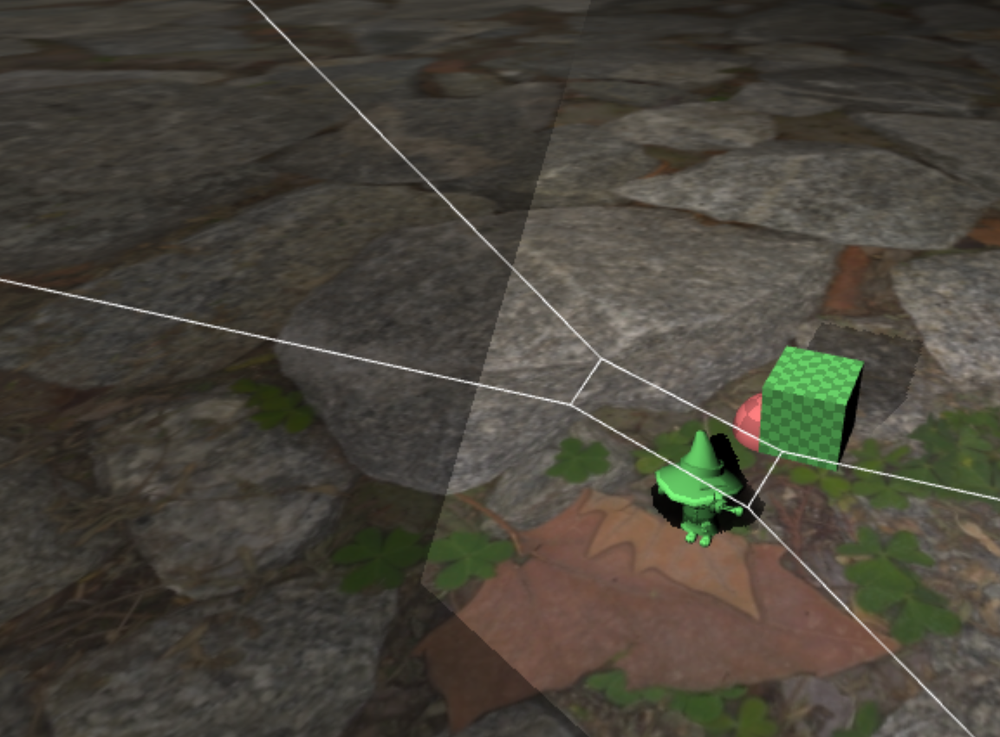

# WebGL 2.0 Shadow Mapping and Texturing Example

This project demonstrates the implementation of shadow mapping and texturing using WebGL 2.0. The code provides a complete example of how to set up and render 3D objects with realistic lighting and shadows.

## Features

- **Vertex and Fragment Shaders:** Custom GLSL shaders for handling lighting, shadow mapping, and texturing.
- **Multiple Objects:** The scene includes a sphere, a plane, and a cube with shadow and texture mapping.
- **Shadow Mapping:** Implemented to create realistic shadows cast by objects in the scene.
- **Texturing:** Supports multiple textures including an image-based texture and a procedural checkerboard texture.
- **OBJ File Loading:** Ability to load and parse 3D models from OBJ files.

## Shaders

### Vertex Shader (vs)
This shader computes the positions of vertices, applies transformations, and passes data to the fragment shader, such as texture coordinates, normals, and surface-to-view vectors.

### Fragment Shader (fs)
This shader calculates the final color of each pixel, taking into account lighting, shadows, and textures. It uses a combination of diffuse lighting, shadow mapping, and color multiplication.

### Additional Shaders
- `colorVS`: A simplified vertex shader for rendering objects with a solid color.
- `colorFS`: A fragment shader for rendering objects with a single color.

## Usage

1. **Setup WebGL Context:**
   - Initialize the WebGL 2.0 context.
   - Create and compile the shader programs.

2. **Load OBJ Models:**
   - Fetch and parse OBJ files to generate 3D models.
   
3. **Texture Initialization:**
   - Load textures from image files.
   - Create procedural textures like a checkerboard.

4. **Render Loop:**
   - Continuously render the scene, applying shadows and textures to the objects.

## Dependencies

This project relies on the following libraries:

- [twgl.js](https://twgljs.org/) for handling WebGL boilerplate and simplifying shader setup.
- A 3D model loader to parse OBJ files.

## How to Run

1. Clone the repository:

   ```bash
   git clone https://github.com/yourusername/webgl-shadow-mapping.git
   ```

2. Open `index.html` in a web browser that supports WebGL 2.0.

3. Explore the 3D scene with objects and observe the shadows and textures applied.

## Screenshots



### Vídeo

[](SoftShadowsVideo2.mp4)


## References

- [WebGL 2.0 Specification](https://www.khronos.org/registry/webgl/specs/latest/2.0/)
- [GLSL Shaders](https://www.opengl.org/documentation/glsl/)
- [TWGL.js Library](https://twgljs.org/)

## License

This project is licensed under the MIT License - see the [LICENSE](LICENSE) file for details.

## Acknowledgments

- The implementation uses `twgl.js` for managing WebGL operations.
- Thanks to the WebGL 2.0 community for the tutorials and examples that inspired this project.

